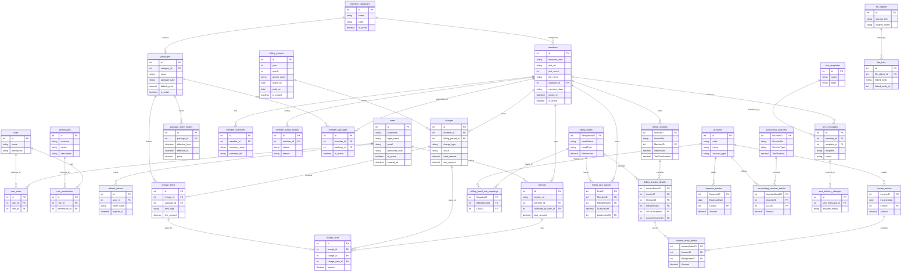

# Society Management Software - Database Diagram

The database is divided into 6 distinct schemas in SQL Server: `auth`, `society`, `billing`, `accounting`, `messaging`, and `files`.

```mermaid
erDiagram
    %% Auth Schema
    users {
        int id PK
        string username
        string login_name
        string email
        string password_hash
        boolean is_active
        datetime created_at
    }
    roles {
        int id PK
        string name
        string description
    }
    permissions {
        int id PK
        string resource
        string action
        string description
    }
    user_roles {
        int id PK
        int user_id FK
        int role_id FK
    }
    role_permissions {
        int id PK
        int role_id FK
        int permission_id FK
    }
    refresh_tokens {
        int id PK
        int user_id FK
        string token_hash
        datetime expires_at
    }

    users ||--o{ user_roles : has
    roles ||--o{ user_roles : belongs_to
    roles ||--o{ role_permissions : has
    permissions ||--o{ role_permissions : belongs_to
    users ||--o{ refresh_tokens : owns

    %% Society Schema
    member_categories {
        int id PK
        string name
        string code
        boolean is_active
    }
    packages {
        int id PK
        int category_id FK
        string name
        string package_type
        decimal default_price
        boolean is_active
    }
    package_price_history {
        int id PK
        int package_id FK
        datetime effective_from
        datetime effective_to
        decimal price
    }
    members {
        int id PK
        string member_code
        string plot_no
        int plot_count
        string full_name
        int category_id FK
        string member_class
        datetime joined_on
        boolean is_active
    }
    member_nominees {
        int id PK
        int member_id FK
        string nominee_name
        string nominee_cell
    }
    member_status_history {
        int id PK
        int member_id FK
        string status
        string reason
    }
    member_packages {
        int id PK
        int member_id FK
        int package_id FK
        boolean is_active
    }

    member_categories ||--o{ packages : contains
    member_categories ||--o{ members : categorizes
    packages ||--o{ package_price_history : tracks
    members ||--o{ member_nominees : has
    members ||--o{ member_status_history : history
    members ||--o{ member_packages : subscribed_to
    packages ||--o{ member_packages : provides

    %% Billing Schema
    billing_periods {
        int id PK
        int year
        int month
        string period_name
        date starts_on
        date ends_on
        boolean is_closed
    }
    charges {
        int id PK
        int member_id FK
        int billing_period_id FK
        string charge_type
        string status
        decimal total_amount
        decimal due_amount
    }
    charge_items {
        int id PK
        int charge_id FK
        int package_id FK
        string item_type
        decimal line_amount
    }
    receipts {
        int id PK
        string receipt_no
        int member_id FK
        int collected_by_user_id FK
        decimal total_amount
    }
    receipt_lines {
        int id PK
        int receipt_id FK
        int charge_id FK
        int charge_item_id FK
        decimal amount
    }
    billing_heads {
        int BillingHeadID PK
        string HeadName
        string HeadType
        decimal FeeAmount
    }
    billing_head_coa_mappings {
        int MappingID PK
        int BillingHeadID FK
        int COAID FK
    }
    billing_invoices {
        int InvoiceID PK
        string InvoiceNo
        int MemberID FK
        decimal NetAmount
        decimal TotalDueAmount
    }
    billing_invoice_details {
        int InvoiceDetailID PK
        int InvoiceID FK
        int MemberID FK
        int BillingHeadID FK
        int COAIDSnapshot FK
        int IncomeVoucherID FK
    }
    billing_due_tracker {
        int DueID PK
        int MemberID FK
        int BillingHeadID FK
        decimal DueAmount
        int LastInvoiceID FK
    }

    members ||--o{ charges : incurs
    billing_periods ||--o{ charges : covers
    charges ||--o{ charge_items : contains
    packages ||--o{ charge_items : defines
    members ||--o{ receipts : pays
    users ||--o{ receipts : collects
    receipts ||--o{ receipt_lines : has
    charges ||--o{ receipt_lines : pays_for
    charge_items ||--o{ receipt_lines : pays_for
    billing_heads ||--o{ billing_head_coa_mappings : maps_to
    members ||--o{ billing_invoices : billed
    billing_invoices ||--o{ billing_invoice_details : contains
    billing_heads ||--o{ billing_invoice_details : specifies
    members ||--o{ billing_due_tracker : tracks
    billing_heads ||--o{ billing_due_tracker : tracks

    %% Accounting Schema
    accounts {
        int id PK
        string code
        string name
        string account_type
    }
    income_entries {
        int IncomeID PK
        date IncomeDate
        int COAID FK
        decimal Amount
    }
    income_entry_details {
        int IncomeDetailID PK
        int IncomeID FK
        int BillingDetailID FK
        decimal Amount
    }
    expense_entries {
        int ExpenseID PK
        date ExpenseDate
        int COAID FK
        decimal Amount
    }
    accounting_vouchers {
        int VoucherID PK
        string VoucherNo
        string VoucherType
        decimal TotalAmount
    }
    accounting_voucher_details {
        int VoucherDetailID PK
        int VoucherID FK
        int COAID FK
        decimal Amount
    }

    accounts ||--o{ billing_head_coa_mappings : mapped_by
    accounts ||--o{ income_entries : credits
    income_entries ||--o{ income_entry_details : contains
    billing_invoice_details ||--o{ income_entry_details : source
    accounts ||--o{ expense_entries : debits
    accounting_vouchers ||--o{ accounting_voucher_details : contains
    accounts ||--o{ accounting_voucher_details : affects

    %% Messaging Schema
    sms_templates {
        int id PK
        string name
        string body
    }
    sms_messages {
        int id PK
        int member_id FK
        int template_id FK
        string recipient
        string status
    }
    sms_delivery_attempts {
        int id PK
        int sms_message_id FK
        string provider_status
    }

    members ||--o{ sms_messages : receives
    sms_templates ||--o{ sms_messages : formatted_by
    sms_messages ||--o{ sms_delivery_attempts : tracked_by

    %% Files Schema
    file_objects {
        int id PK
        string storage_key
        string original_name
    }
    file_links {
        int id PK
        int file_object_id FK
        string linked_entity
        int linked_entity_id
    }

    file_objects ||--o{ file_links : linked_by
```
