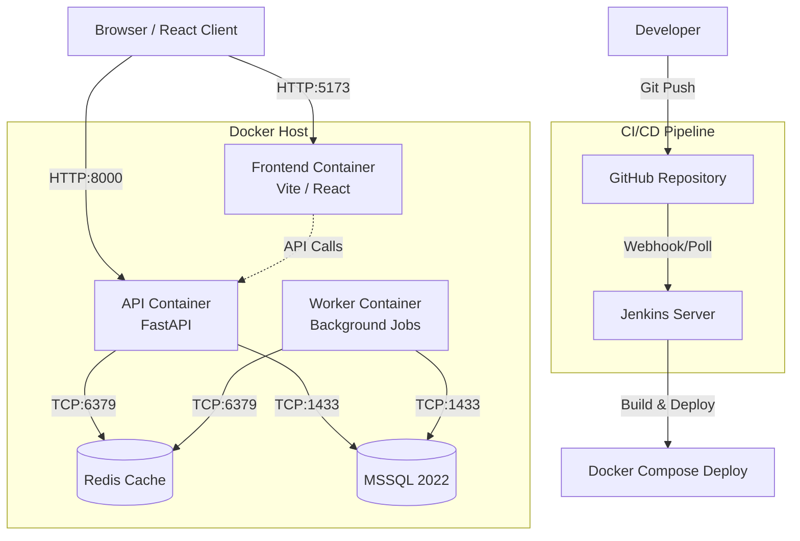
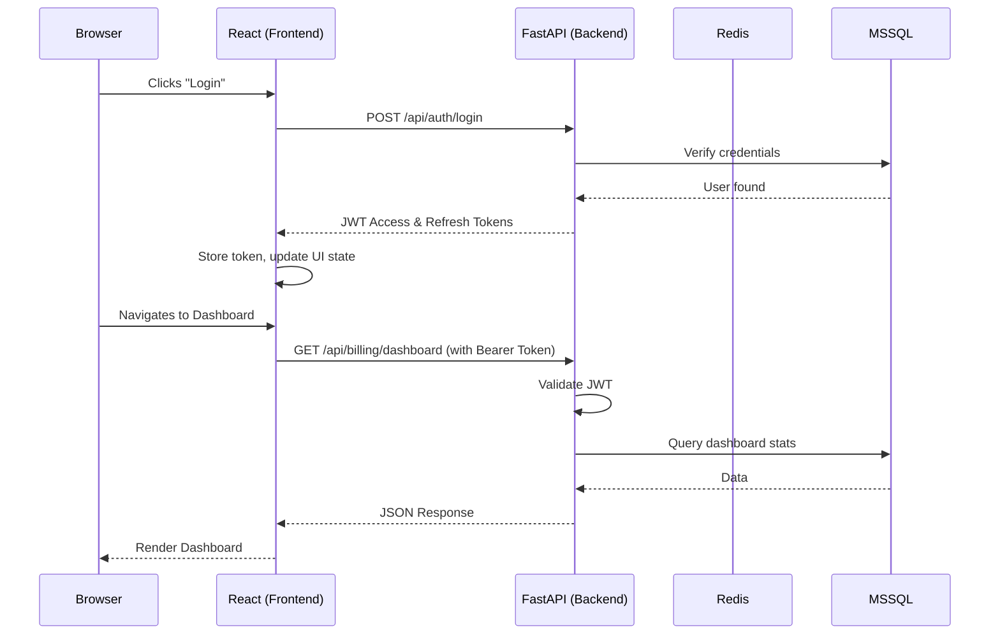

# Society Management Software - Project Architecture

## System Overview

The application follows a modern 3-tier architecture, containerized for local development and deployment.

## Module Breakdown (Backend)

The backend is built with FastAPI and organized into domain-driven modules inside `app/modules/`:

1. **`auth/`**: User authentication, JWT issuance, roles, and permissions.
2. **`society/`**: Core society entities (categories, packages, members).
3. **`billing/`**: Billing logic (periods, charges, receipts, invoices, due tracking). Includes a complex carry-forward and due calculation system.
4. **`accounting/`**: Chart of Accounts (COA), income/expense entries, and vouchers.
5. **`messaging/`**: SMS templates, message queues, and BulkSMSBD provider integration.
6. **`reporting/`**: Data aggregation for various reports (HTML/XLSX exports).
7. **`files/`**: Metadata tracking for uploaded files (currently models only).
8. **`jobs/`**: Tracking models for asynchronous background tasks.

## Request Flow

## CI/CD Pipeline Flow

1. **Local Development**: Developer edits code locally in `C:\Users\Nazrul Islam\Desktop\SocietyProject`.
2. **Version Control**: Developer pushes to `main` branch on GitHub (`pulok529/Makan_Society_ReactPython`).
3. **Trigger**: Jenkins detects the change (via webhook or polling).
4. **Checkout & Prepare**: Jenkins pulls the latest code and copies the production `.env` file from a secure location.
5. **Build & Deploy**: Jenkins runs `docker compose -f docker-compose.deploy.yml up -d --build`.
6. **Health Check**: Jenkins waits and pings the API (`/docs`) and Frontend to ensure successful startup.
